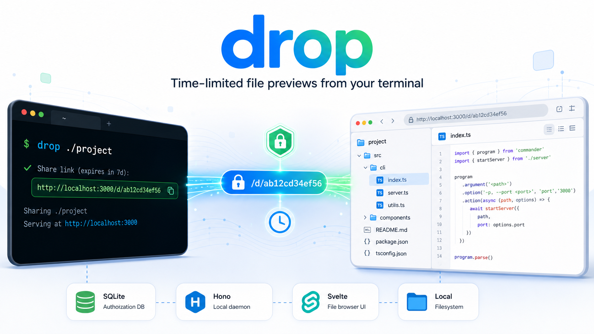
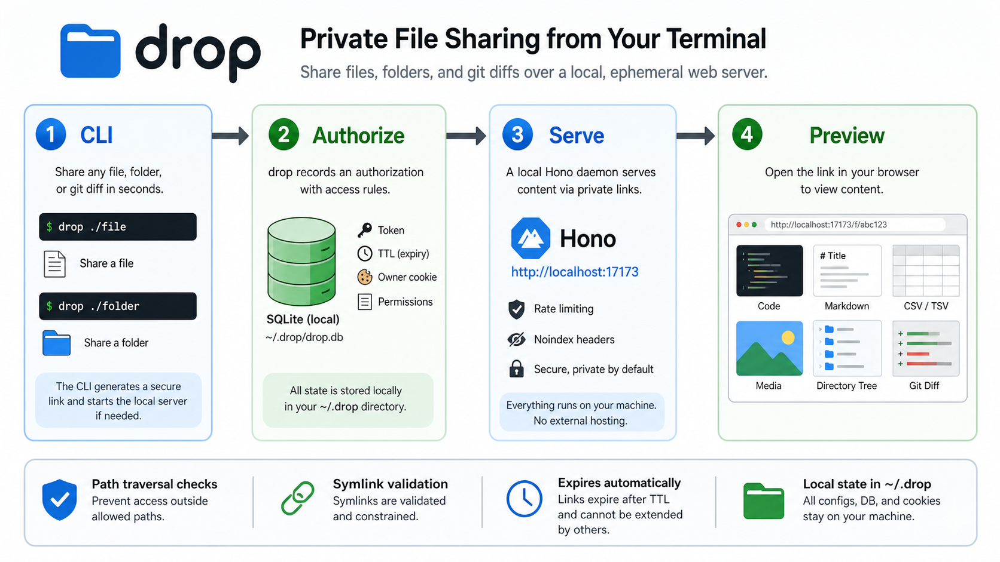

# drop

[简体中文](README.zh-CN.md) | English

Share local files, folders, stdin content, and Git diffs through time-limited preview URLs.



`drop` is a small CLI for turning local content into browser-friendly preview links. It starts a local web server when needed, stores share state under `~/.drop`, and renders common developer formats with readable previews.

## Why use it?

- Share code, logs, configs, Markdown, CSV, media, or generated artifacts without leaving the terminal.
- Give an AI coding agent a reliable way to show files it created or edited.
- Share a whole project directory with a searchable file tree and split-pane preview UI.
- Turn a Git commit into a readable page with metadata and highlighted diffs.
- Keep access temporary by default with TTL-based links.

## At a Glance

| Need | Command |
| --- | --- |
| Share one file | `drop README.md` |
| Share a browsable folder | `drop .` |
| Share terminal output | <code>command &#124; drop share --type text</code> |
| Share Markdown from stdin | <code>echo "# Hi" &#124; drop share --type markdown</code> |
| Share current Git diff | <code>git diff &#124; drop share --type diff</code> |
| Share a commit | `drop allow-git . HEAD` |
| List active shares | `drop list` |
| View access stats | `drop stats --json` |
| Stop the daemon | `drop stop` |

## Contents

- [Quick Start](#quick-start)
- [How It Works](#how-it-works)
- [For AI Agents](#for-ai-agents)
- [Install](#install)
- [Usage](#usage)
- [Commands](#commands)
- [Configuration](#configuration)
- [Rendering](#rendering)
- [Security Model](#security-model)
- [Public Access](#public-access)
- [Development](#development)

## Quick Start

Install the latest release:

```bash
curl -fsSL https://raw.githubusercontent.com/junping1/drop/master/install.sh | bash
```

Share a file:

```bash
drop README.md
```

Share a directory:

```bash
drop .
```

Share piped content:

```bash
git diff | drop share --type diff --title "current changes"
```

Each command prints a URL. Open it in a browser or send it to someone who should be able to preview the content.

## How It Works



1. The CLI records an authorization in the local SQLite database.
2. The daemon serves private token URLs from your machine.
3. The browser requests `/f/:token`, `/d/:token`, or `/git/:token`.
4. The server checks expiry, reads local content, and returns a rendered preview or raw file.

Runtime state lives in `~/.drop/`:

| Path | Purpose |
| --- | --- |
| `~/.drop/drop.db` | SQLite authorization database |
| `~/.drop/config.json` | config and owner key |
| `~/.drop/drop.pid` | daemon PID |
| `~/.drop/drop.log` | daemon log |
| `~/.drop/shares/` | temporary files created from stdin shares |

## For AI Agents

Copy this block into your coding agent instructions so it can install and use `drop-preview` consistently. `drop-preview` is an alias for `drop` with a less ambiguous name for agents; keep treating it as a preview-link command, not a Git discard/drop operation:

```text
Install and use `drop-preview` (alias of `drop`), a CLI tool for sharing local files through time-limited preview URLs.

Install:
  curl -fsSL https://raw.githubusercontent.com/junping1/drop/master/install.sh | bash

Expose links:
  drop-preview serve
  # If you use an external tunnel, set the public URL:
  drop-preview config set base_url https://your-domain.example

Use:
  drop-preview /path/to/file                           # share a file
  drop-preview /path/to/dir                            # share a browsable directory
  drop-preview /path/to/file --ttl 3600                # custom TTL in seconds
  drop-preview /path/to/file --live                    # auto-refresh when the file changes
  echo "content" | drop-preview share --type markdown  # share piped content
  git diff | drop-preview share --type diff            # share a diff
  drop-preview list                                    # list active shares

Behavior:
  - After creating or editing a file that the user should inspect, run `drop-preview` on it and send the URL.
  - When the user asks to see a file, show a preview, or get a link, use `drop-preview`.
  - For directories, use `drop-preview /path/to/dir` so the user gets the browsable UI.
  - Do not share secrets, `.env` files, API keys, tokens, or credential backups.
```

### AI Decision Rules

| User intent | Agent action |
| --- | --- |
| "Show me this file" | Run `drop-preview /path/to/file` and return the URL. |
| "Show me this folder/project" | Run `drop-preview /path/to/dir` and return the URL. |
| "Show me your changes" | Prefer <code>git diff &#124; drop-preview share --type diff --title "changes"</code>. |
| "Share the generated report" | Run `drop-preview` on the generated artifact. |
| "Make this public" | Ask which tunnel/base URL to use, then set `base_url`. |
| Content may contain secrets | Do not share; ask for confirmation or exclude sensitive paths. |

Machine-readable summary:

```yaml
tool: drop-preview
alias_of: drop
purpose: Share local content through temporary preview URLs.
default_ttl_seconds: 86400
state_dir: ~/.drop
share_file: drop-preview /path/to/file
share_directory: drop-preview /path/to/dir
share_stdin: command | drop-preview share --type text
share_diff: git diff | drop-preview share --type diff
list_shares: drop-preview list
stats: drop-preview stats --json
stop_daemon: drop-preview stop
never_share:
  - .env
  - API keys
  - OAuth credentials
  - tokens
  - password files
  - database backups
```

## Install

One-line install for Linux/macOS:

```bash
curl -fsSL https://raw.githubusercontent.com/junping1/drop/master/install.sh | bash
```

Install from a fork or another release repository:

```bash
curl -fsSL https://raw.githubusercontent.com/owner/drop/master/install.sh | DROP_REPO=owner/drop bash
```

Build from source:

```bash
git clone https://github.com/junping1/drop.git
cd drop
bun install

# Build the default Linux x64 binary.
bun run build
cp dist/drop-linux-x64 ~/.local/bin/drop

# Or build for a specific platform.
bun run scripts/build.ts --target linux-x64
bun run scripts/build.ts --target linux-arm64
bun run scripts/build.ts --target darwin-x64
bun run scripts/build.ts --target darwin-arm64
```

Source builds require Bun v1.0+. Release assets are expected to be named `drop-linux-x64`, `drop-linux-arm64`, `drop-darwin-x64`, and `drop-darwin-arm64`; see [the release checklist](docs/RELEASE.md) before publishing a release.

## Usage

The `allow` subcommand is implicit:

```bash
drop ~/file.py
drop allow ~/file.py
```

Both commands share the same file. The daemon starts automatically if it is not already running.

### Custom slugs

Use `--slug` when you want a readable public URL instead of only the generated token URL:

```bash
drop allow ~/report.pdf --slug q2-report
drop share --content "hello" --slug hello-note
drop allow-git . HEAD --slug release-review
```

Slug links use the same bearer-link security model as token links: `/f/:slug`, `/d/:slug`, and `/git/:slug` are accessible to anyone who knows the URL until the share expires or is revoked. The original token URL remains valid. Slugs are global, lowercased, 3-64 characters, may contain letters, numbers, `_`, and `-`, and must start and end with a letter or number. Route names such as `api`, `raw`, `dashboard`, `f`, `d`, `git`, `list`, and `revoke` are reserved. Non-JSON output prints a warning because custom slugs are easier to guess.

`drop list --json` includes `slug` and the public `url` when a slug exists, and `drop revoke <id>` accepts either the token or slug.

### Choosing the right command

| Content | Best command |
| --- | --- |
| Existing file | `drop /path/to/file` |
| Existing directory | `drop /path/to/dir` |
| Generated text | `drop share --content "..." --type text` |
| Command output | <code>command &#124; drop share --type text</code> |
| Markdown output | <code>command &#124; drop share --type markdown</code> |
| Code snippet | `drop share --content "..." --type code` |
| Git diff | <code>git diff &#124; drop share --type diff</code> |
| Git commit | `drop allow-git . HEAD` |

### Files

```bash
drop ~/file.py                     # share a file
drop ~/file.py --ttl 300           # expire in 5 minutes
drop ~/file.py --head 50           # show only the first 50 lines
drop ~/file.py --tail 50           # show only the last 50 lines
drop ~/file.py --live              # reload preview when the file changes
drop ~/file.py --qr                # also print a terminal QR code to stderr
drop ~/file.py --force             # scan secrets, then share even if findings exist
drop ~/file.py --no-secret-scan    # skip the pre-share secret scan
drop ~/file.py --slug demo-file    # readable /f/demo-file URL
```

### Directories

```bash
drop ~/project/                    # share a browsable file tree
drop ~/project/ --ttl 7200         # custom TTL
drop ~/project/ --exclude '*.log'  # add exclude patterns
drop ~/project/ --live             # refresh when the directory changes
drop ~/project/ --qr               # also print a terminal QR code to stderr
drop ~/project/ --force            # scan secrets, then share even if findings exist
drop ~/project/ --no-secret-scan   # skip the pre-share secret scan
drop ~/project/ --slug demo-dir    # readable /d/demo-dir URL
```

Default excludes: `.git/`, `__pycache__/`, `.env`, `node_modules/`, `.DS_Store`, `*.pyc`, `.venv/`.

### Stdin

```bash
echo "# Hello" | drop share --type markdown
git diff | drop share --type diff --title "my changes"
drop share --content "print('hi')" --type python
echo "# Hello" | drop share --type markdown --qr
drop share --content "..." --force --json
drop share --content "..." --no-secret-scan --json
drop share --content "hello" --slug hello-note
```

Supported types: `markdown`, `python`, `javascript`, `json`, `yaml`, `html`, `css`, `shell`, `diff`, `code`, `text`.

### Secret scanning

Before creating a file, directory, stdin, or Git commit authorization, `drop` scans for high-confidence secrets by default. A blocking finding prevents authorization creation; for stdin shares, it also avoids writing the temporary file and avoids starting the daemon.

Covered rules include private keys, GitHub tokens, OpenAI/Anthropic API keys, Slack tokens, Stripe live keys, Google API keys, AWS access key IDs, Google service-account JSON, and sensitive filenames such as `credentials.json`, `secrets.yaml`, `*.pem`, `*.key`, `.npmrc`, and `.netrc`.

Directory scans use the same default excludes as directory sharing plus any `--exclude` patterns, and do not follow symlinks that escape the shared directory or create cycles.

Override flags:

| Flag | Behavior |
| --- | --- |
| `--force` | Run the scan but continue even when findings exist. JSON success output includes `secret_scan.forced`, `findings_count`, and sanitized `findings`. |
| `--no-secret-scan` | Skip the scan. JSON success output includes `secret_scan.disabled`. |

`--force` and `--no-secret-scan` are mutually exclusive. Secret scan output is sanitized: it reports fields such as `path`, `line`, `rule_id`, `severity`, and `fingerprint`, never the raw secret value or full source line.

### Git Commits

```bash
drop allow-git /path/to/repo abc1234
drop allow-git . HEAD
drop allow-git . HEAD --qr
drop allow-git . HEAD --force
drop allow-git . HEAD --no-secret-scan
drop allow-git . HEAD --slug release-review
```

Git commit shares render commit metadata, changed files, and expandable highlighted diffs.

### Terminal QR codes

Add `--qr` to print a terminal QR code for the generated URL. QR output is written to stderr, so stdout remains the plain URL or parseable JSON:

```bash
drop allow ~/file.py --qr
drop allow ~/project/ --qr
drop share --content "hello" --type text --qr
drop allow-git . HEAD --qr
drop owner-url --qr
drop allow ~/file.py --json --qr | jq .
```

If QR rendering fails, the share still succeeds and Drop prints a warning to stderr. Failed share commands do not print QR output.

## Commands

| Command | Description |
| --- | --- |
| `drop <path>` | share a file or directory |
| `drop allow <path>` | explicit form of `drop <path>` |
| `drop share` | share stdin or inline text |
| `drop allow-git <repo> <commit>` | share a Git commit diff |
| `drop allow <path> --qr` | print the share URL and a terminal QR code on stderr |
| `--slug` on share commands | create a readable bearer URL slug |
| `--force` on share commands | scan secrets but continue when findings exist |
| `--no-secret-scan` on share commands | skip the pre-share secret scan |
| `drop list` | list active and expired shares |
| `drop list --json` | list shares as JSON |
| `drop stats [token] --json --since <24h\|7d\|30d>` | show access view, unique visitor, and last access stats |
| `drop stats [token] --include-live` | include live polling events in view counts |
| `drop revoke <token-or-slug>` | revoke a file, directory, or Git share token/slug and delete its access events |
| `drop owner-url` | print the owner dashboard URL |
| `drop status` | check daemon status |
| `drop stop` | stop the daemon |
| `drop serve` | start the server in the foreground |
| `drop config get <key>` | read a config value |
| `drop config set <key> <value>` | write a config value |


## Access Stats

`drop` records privacy-preserving access events for successful share views. Default view counts include rendered page views (`/f/:token`, `/d/:token`, `/d/:token/*`, `/git/:token`) and raw directory file views (`/d/:token/raw`). Directory tree/file preview API calls may be recorded as `api_tree` and `api_preview`, but they are not counted as views by default. Live polling is not included unless `--include-live` is used.

```bash
drop stats --json
drop stats <token-or-slug> --json --since 7d
drop stats <token-or-slug> --include-live
```

The owner-only dashboard and `/api/stats` / `/api/stats/:token-or-slug` endpoints expose the same view, unique visitor, and last access totals.

Privacy notes: access events never store raw IP addresses, full user agents, full referrers, full directory paths, query strings, cookies, or owner keys. Client identity and directory target paths are stored as HMAC hashes, referrers are reduced to origin, user agents are coarse browser/tool categories, and target paths keep only a hash plus file extension. Revoking a token deletes its access events.

## Configuration

```bash
drop config set base_url https://files.example.com
drop config get base_url
```

| Key | Default | Description |
| --- | --- | --- |
| `base_url` | `http://localhost:17173` | public URL prefix for generated links |
| `port` | `17173` | server listen port |
| `file_ttl` | `86400` | default file-share TTL in seconds |
| `dir_default_ttl` | `86400` | default directory-share TTL in seconds |
| `auto_stop` | `false` | stop the daemon when all shares expire |

## Rendering

| Type | Rendering |
| --- | --- |
| Code (`.py`, `.js`, `.ts`, `.go`, `.rs`, etc.) | syntax highlighting via highlight.js |
| Markdown (`.md`) | rendered HTML with readable document styling |
| CSV/TSV | styled HTML table |
| PDF | browser-native PDF viewer |
| SVG | image preview via data URI |
| Audio/video | HTML5 player |
| Images | inline display |
| Git commits | metadata and expandable highlighted diffs |
| Other files | raw response with guessed content type |

## Security Model

- Nothing is accessible until it is explicitly shared.
- Shares expire automatically according to their TTL.
- File, directory, and Git tokens are at least 32 hex characters (128 bits), and owner keys are 32 hex characters.
- Directory access uses path traversal checks and symlink validation.
- Pre-share secret scanning is enabled by default for file, directory, stdin/content, and Git commit shares. Blocking findings are reported only with sanitized metadata and fingerprints.
- Responses include anti-crawler headers and `robots.txt` disallows indexing.
- Owner access uses HMAC-signed cookies and timing-safe key comparison.
- Access logging is privacy-preserving: raw IPs, full user agents, full referrers, full target paths, query strings, cookies, and owner keys are not stored.
- Current rate limiting is 300 requests per minute per client identity. Proxy headers are ignored unless `DROP_TRUST_PROXY=1` is set for a trusted reverse proxy.

Important boundaries:

- Unexpired token and slug URLs are bearer links. Anyone with the URL can access the shared content until it expires or is revoked. Custom slugs are human-readable and may be guessable, so do not use them for sensitive content.
- Markdown raw HTML is escaped, SVG is rendered through an image preview, and template-controlled file metadata is HTML-escaped. Still treat shared files as bearer-link content and avoid sharing untrusted or sensitive material.
- Avoid sharing secrets, `.env` files, API keys, OAuth credentials, database backups, or directories that may contain them.

## Public Access

For local-only use, the default URL is usually enough:

```bash
drop README.md
```

For public sharing, run your preferred tunnel and set `base_url`:

```bash
cloudflared tunnel --url http://127.0.0.1:17173
ngrok http 17173
tailscale funnel 17173

drop config set base_url https://your-domain.example
```

For a Cloudflare named tunnel, point ingress at `127.0.0.1` instead of `localhost` so the connector does not accidentally try IPv6 loopback when Drop is bound to `0.0.0.0` / IPv4:

```yaml
ingress:
  - hostname: share.example.com
    service: http://127.0.0.1:17173
  - service: http_status:404
```

After changing tunnel config, restart `cloudflared` and smoke test both the local and public URL:

```bash
drop allow README.md --slug smoke-test
curl -fsS http://127.0.0.1:17173/f/smoke-test | head
curl -fsS https://share.example.com/f/smoke-test | head
drop stats smoke-test --json
```

`drop serve --tunnel` is reserved for future built-in tunnel support and does not currently start a tunnel. For now, run `cloudflared`, `ngrok`, or `tailscale funnel` yourself, then set `base_url` with `drop config set base_url <public-url>`.

## Development

```bash
bun install
bun run dev:serve          # start server in foreground
bun run build:web          # build the Svelte directory browser
bun run dev:web            # run the Svelte dev server
bun run build              # compile the default linux-x64 standalone binary
bun run scripts/build.ts --target darwin-x64   # build a specific target
bun run build:release      # build all release assets expected by install.sh
bun run verify             # run the project verification entrypoint
```

Supported build targets are `linux-x64`, `linux-arm64`, `darwin-x64`, and `darwin-arm64`.

## License

MIT
